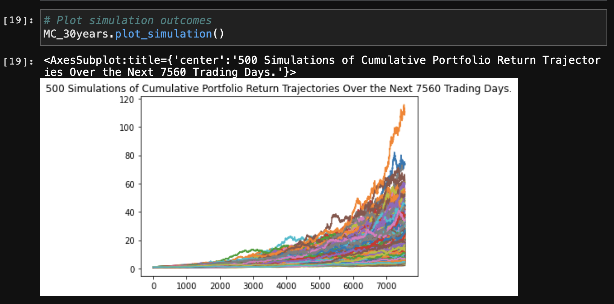

# financial_planner

Two financial analysis tools have been developed in the following code.  The first tool is a personal finance planner that allows users to visualize their savings composed by investments in shares and cryptocurrencies to assess if they have enough money as an emergency fund.  The second tool is a retirement planning tool that uses the Alpaca API to fetch historical closing prices for a retirement portfolio composed of stocks and bonds, then run Monte Carlo simulations to project the portfolio performance at 30 years. Then the Monte Carlo data is used to calculate the expected portfolio returns given a specific initial investment amount.

---

## Technologies

Language: Python3, Pandas 

Imports: os, requests, pandas, numpy, json, datetime, dotenv, matplotlib, alpaca_trade_api and MCForecastTools

External Resources: Alpaca Markets API and Alternative Free Crypto API

Developed with JupyterLab

---

## Installation

JupyterLab - [Install JupyterLab](https://jupyterlab.readthedocs.io/en/stable/getting_started/installation.html)

---

## Examples

After reading in cryptocurrency prices from the Alternative Free Crypto API and historical stock data from the Alpaca Markets API, current values are computed and portfolio composition is visualized in pie chart called "Personal Savings:.

Visualization of the results of a Monte Carlo Simulation: 500 simulations of cumulative portfolio return trajectories over the next 7560 trading d.ays

---

## Contributors

Drew Disbrow Marnell: dldmarnell@gmail.com

---

## License

MIT License
Copyright (c) 2021 Drew Disbrow Marnell
